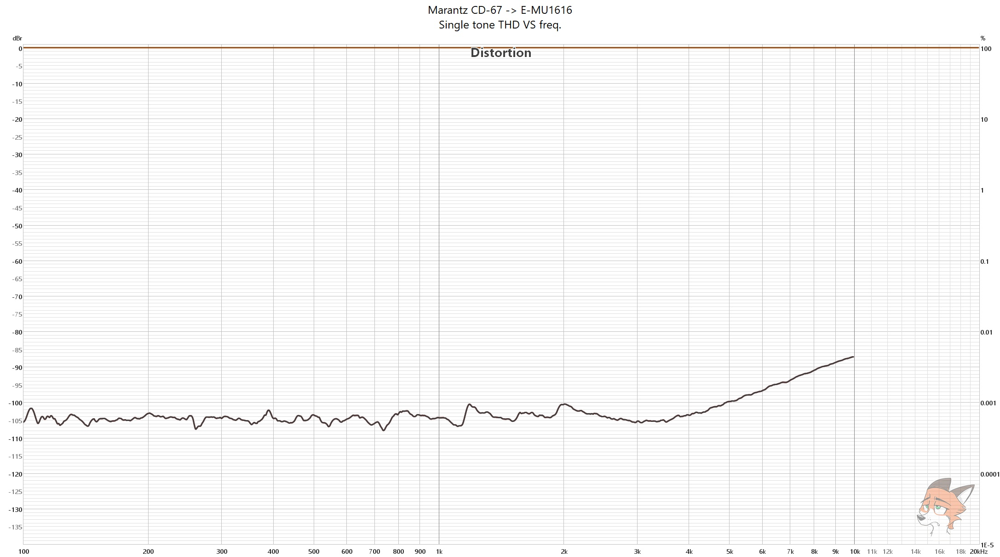

# Marantz CD-67 mkii CD player measurements

### [ASR review](https://www.audiosciencereview.com/forum/index.php?threads/marantz-cd-67-measurements-newbie-alert.58050/)

TL;DR: pretty solid player for its price 

**Marantz CD-67 mkii -> E-MU1616 (LINE IN)**

Analysis settings, unless said otherwise, are:

* **32k FFT**
* **8 averages**
* **Dolph-Chebyshev 200 window**
* **0% overlap**

**512K FFT** 

**255 averages**

**256K FFT**

**256K FFT**

