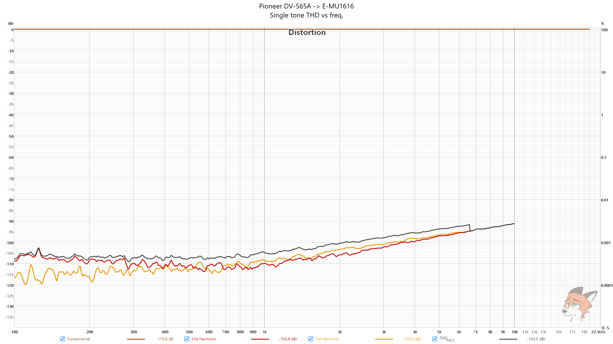

# Pioneer DV-565A CD/DVD player measurements

### [ASR review](https://www.audiosciencereview.com/forum/index.php?threads/pioneer-dv-565a-cd-dvd-measurements.62081/)

TL;DR: decent player (at least in CD mode)

**Pioneer DV-565A -> E-MU1616 (LINE IN)**

Analysis settings, unless said otherwise, are:

* **32k FFT**
* **8 averages**
* **Dolph-Chebyshev 200 window**
* **0% overlap**

**512K FFT** 

**255 averages**

**256K FFT**

*256K FFT**

