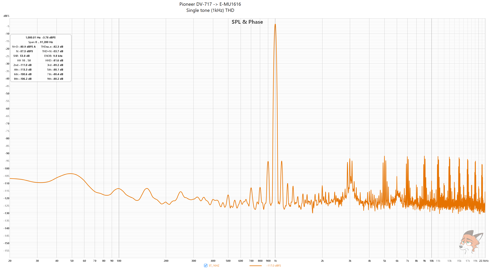
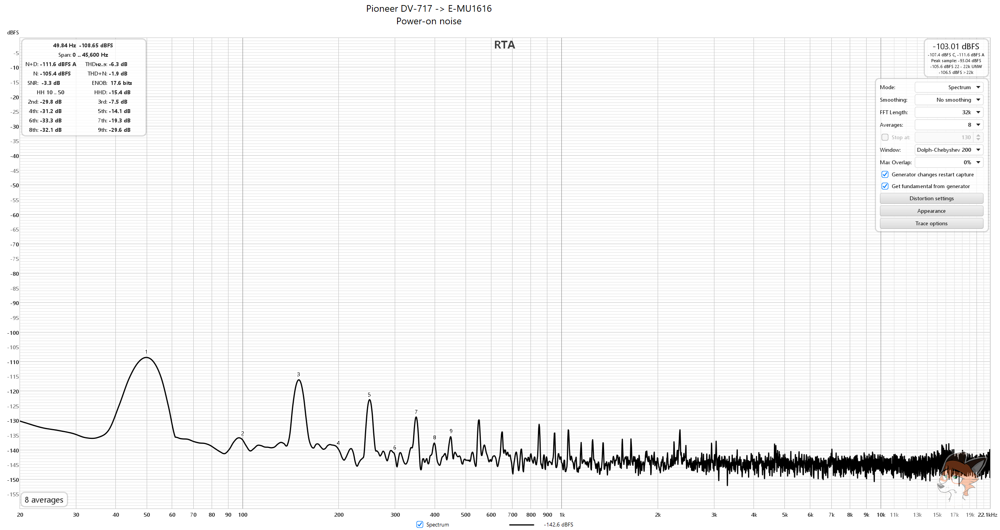
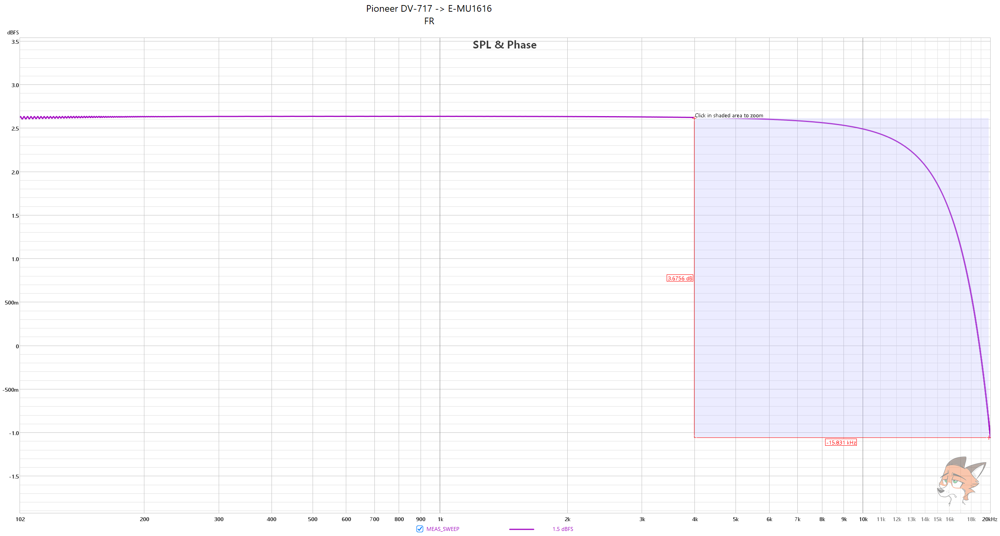
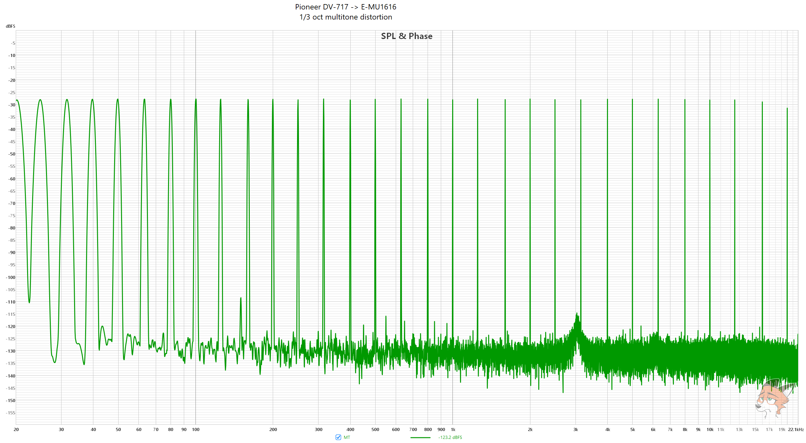
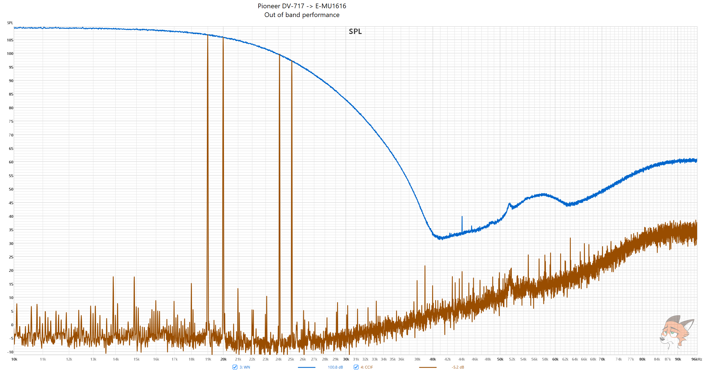
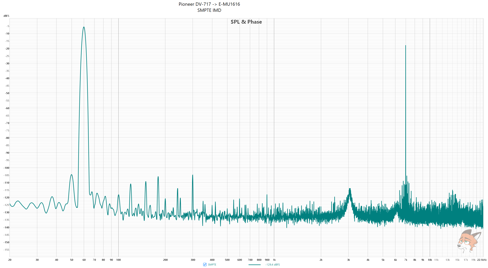
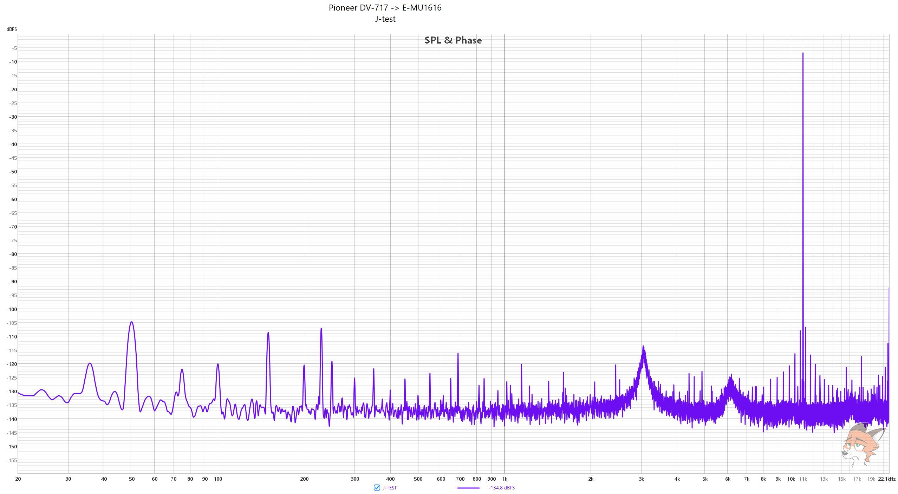
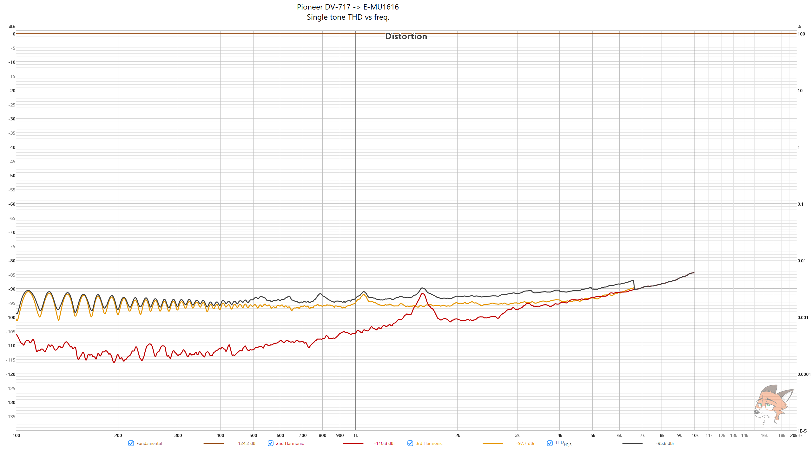

# Pioneer DV-717 CD/DVD player measurements

### [ASR review](https://www.audiosciencereview.com/forum/index.php?threads/pioneer-dv-717-cd-dvd-measurements.62034/)

TL;DR: piece of crap, literally nothing is good (aside from looks)

**Pioneer DV-717 -> E-MU1616 (LINE IN)**

Analysis settings, unless said otherwise, are:

* **32k FFT**
* **8 averages**
* **Dolph-Chebyshev 200 window**
* **0% overlap**

**512K FFT** 

**255 averages**

**256K FFT**

**256K FFT**

