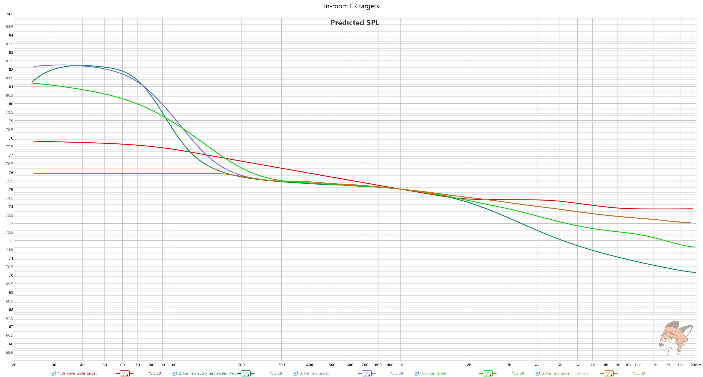

This folder contains a collections of .txt versions of steady-state target FRs, pulled from this [ASR post](https://www.audiosciencereview.com/forum/index.php?threads/a-collection-of-speaker-target-responses-in-csv-txt-format.16401/) + my variation of Harman In-room with no bass boost (I use that)

